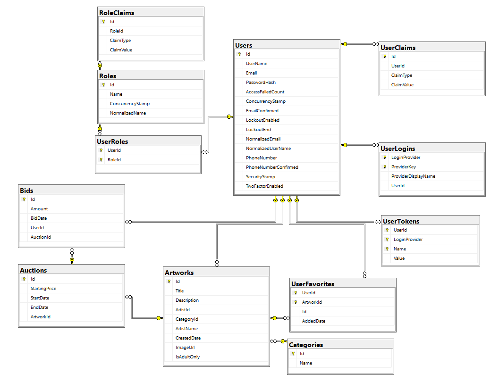

<p align="center"><h1 align="center">ArtAuctionHub</h1></p>
<p align="center">
	<em><code>❯ Zsolt05</code></em>
</p>
<p align="center">
	
	
	
	
</p>
<br>

## Table of Contents

- [Overview](#overview)
  - [What You Can Learn from ArtAuctionHub](#what-you-can-learn-from-artauctionhub)
  - [Introduction to ASP.NET Core and Web Hosting](#introduction-to-aspnet-core-and-web-hosting)
  - [Servers, Routing, and Controllers](#servers-routing-and-controllers)
  - [Dependency Injection (DI) and Services](#dependency-injection-di-and-services)
  - [Entity Framework Core (EF Core) and Data Access](#entity-framework-core-ef-core-and-data-access)
  - [Repository & Unit of Work Pattern](#repository-and-unit-of-work-pattern)
  - [Middleware and the Request Pipeline](#middleware-and-the-request-pipeline)
  - [Authentication, Identity, and Authorization](#authentication-identity-and-authorization)
  - [Logging and Error Handling](#logging-and-error-handling)
  - [Caching and Performance](#caching-and-performance)
  - [RESTful Web API Design](#restful-web-api-design)
  - [Real-Time Applications: WebSocket and SignalR](#real-time-applications-websocket-and-signalr)
  - [Supporting Tools and Advanced Topics](#supporting-tools-and-advanced-topics)
- [Project Structure](#project-structure)
- [Getting Started](#getting-started)
  - [Prerequisites](#prerequisites)
  - [Installation](#installation)
  - [Usage](#usage)
- [Database](#database)
  - [Database Image](#database-image)
  - [Entity Framework Core Migrations](#entity-framework-core-migrations)

---

##  Overview

ArtAuctionHub is a comprehensive educational project created to teach how modern web applications are built — from the first line of code to a functional, real-time system.  
It is based on the concept of an **online art auction platform**, where **artists** can upload artworks and start auctions, while **buyers** can place bids and interact in real time.

At its core, the project shows how professional web systems are designed, structured, and maintained.  
It combines all the major areas of backend development — from server configuration and database design to authentication, middleware, and real-time communication — into one coherent learning experience.

---

### What You Can Learn from ArtAuctionHub

The project is designed to help students, junior developers, and anyone interested in backend programming understand **how all the pieces of a web application fit together**.  
It doesn’t just demonstrate *what* works, but also *why* each part is necessary and *how* it fits into the bigger picture.

Here are the main topics covered through the system:

---

### Introduction to ASP.NET Core and Web Hosting

ArtAuctionHub starts with the basics of how a web application runs on a server.  
Students learn how **ASP.NET Core** applications are hosted using **Kestrel** (the built-in web server), and how they can be configured to listen for incoming requests.  
The project introduces the **Program class**, explaining how an application’s entry point initializes all components, services, and middleware before it starts serving users.

---

### Servers, Routing, and Controllers

Routing defines how the server decides *which code to run* when a specific URL is requested.  
In this project, routing is implemented using **controllers**, such as:
- `AuthController` (for login and registration)
- `ArtworksController` (for managing artworks)
- `AuctionsController` (for auction management)
- `BidsController` (for placing bids)
- `FavoritesController` (for managing favorite artworks)
- `CategoriesController` (for listing artwork categories)

Each controller represents a logical part of the system, responding to API requests like `GET /api/artworks` or `POST /api/bids`.  
This structure mirrors real-world RESTful API design, where every endpoint has a clear purpose.

---

### Dependency Injection (DI) and Services

A key principle in professional software engineering is **Dependency Injection (DI)** — a design pattern that allows different parts of an application to work together without being tightly connected.  
In ArtAuctionHub, all controllers receive their dependencies (such as database services or loggers) automatically through DI.

This is combined with a **Service layer** (e.g., `IArtworkService`, `IAuctionService`, `IBidService`), which contains the business logic of the application.  
This separation makes the system modular, testable, and easy to maintain.

---

### Entity Framework Core (EF Core) and Data Access

The project uses **Entity Framework Core**, Microsoft’s modern object-relational mapper (ORM), to manage the database.  
It demonstrates:
- how to define **entities** (like `User`, `Artwork`, `Auction`, `Bid`),
- how to use **migrations** to create and update the database schema,
- and how to connect application logic with persistent data.

Students also learn how to build their **first application with EF Core**, including seeding initial data, defining relationships, and performing CRUD operations (Create, Read, Update, Delete).

---

### Repository and Unit of Work Pattern

To keep the code organized and clean, ArtAuctionHub uses the **Repository pattern** to handle database interactions and the **Unit of Work pattern** to coordinate changes.  
This ensures that all database operations are handled in a structured and consistent way.

By studying this section, students see how large-scale enterprise applications isolate their data access logic for better scalability and reliability.

---

### Middleware and the Request Pipeline

ASP.NET Core uses a concept called **middleware**, where every incoming request passes through a sequence of processing steps before reaching its destination.  
ArtAuctionHub includes several real-world examples:
- **RequestLoggingMiddleware** — logs each request and its response time.
- **ExceptionHandlingMiddleware** — captures errors globally and returns standardized JSON error messages.
- **AuctionExistenceMiddleware** — checks if an auction exists before processing related requests.
- **AuctionBidWebSocketMiddleware** — enables real-time communication between users through WebSockets.

By experimenting with these, students can learn to write their own **custom middleware** — a critical skill for handling security, validation, and monitoring tasks.

---

### Authentication, Identity, and Authorization

Security is a fundamental part of any web system.  
ArtAuctionHub demonstrates how to implement:
- **User Authentication** using ASP.NET Core Identity and JWT (JSON Web Tokens).  
- **Role-based Authorization** to control what Artists, Buyers, and Guests can do.
- **Identity Management**, including password hashing and secure token generation.

Through this, students learn how to protect APIs and manage user roles in real-world applications.

---

### Logging and Error Handling

Robust logging and error handling are essential for maintaining and debugging applications.  
ArtAuctionHub integrates the default **ASP.NET Core logging framework**, showing how to log important events, warnings, and errors.

The **ExceptionHandlingMiddleware** also provides standardized error responses, giving students a practical understanding of how professional systems deal with failures gracefully.

---

### Caching and Performance

ArtAuctionHub uses several caching techniques to improve performance:
- **In-memory caching** for storing frequent data such as artworks, favorites, and categories.
- **Response caching** to speed up repeated GET requests.

These examples show how caching can dramatically improve speed and reduce server load, a vital skill for scaling applications.

---

### RESTful Web API Design

The project follows the principles of **RESTful API design**, where each endpoint corresponds to a resource and uses standard HTTP methods (`GET`, `POST`, `PUT`, `DELETE`).  
This teaches how modern APIs are designed for clarity, predictability, and compatibility across platforms.

---

### Real-Time Applications: WebSocket and SignalR

A standout feature of ArtAuctionHub is its real-time auction system.  
Using **WebSockets** and **SignalR**, the system sends live updates to all users as soon as a new bid is placed.  

This section demonstrates:
- how persistent client-server connections work,
- how messages are broadcasted to multiple users,
- and how to handle live interactions efficiently.

It’s a perfect example of how online systems like auctions, chats, or games maintain constant updates between users and servers.

---

### Supporting Tools and Advanced Topics

To complete the learning experience, the project also integrates a range of **supporting tools** and **advanced programming concepts**:

| Topic | Description |
|--------|-------------|
| **Swagger (OpenAPI)** | Automatically generates interactive documentation for all endpoints. |
| **Model Validation** | Ensures all incoming data meets specific rules before processing. |
| **Custom Middleware** | Demonstrates how to extend the ASP.NET Core pipeline with your own components. |
| **AutoMapper** | Simplifies object-to-object mapping between entities and DTOs. |
| **Filters** | Provides reusable request-processing logic, such as validation and logging filters. |
| **Options Pattern** | Demonstrates configuration management using IOptions, IOptionsSnapshot, and IOptionsMonitor. |

---
---

##  Project Structure

```sh
└── ArtAuctionHub/
    ├── ArtAuctionHub.sln
    ├── LICENSE
    ├── README.md
    ├── images
    │   └── db-image.jpg
    └── src
        ├── ArtAuctionHub.API
        ├── ArtAuctionHub.Application
        ├── ArtAuctionHub.Domain
        ├── ArtAuctionHub.Infrastructure
        ├── ArtAuctionHub.Shared
        └── ArtAuctionHub.SignalRClientTest
```

---
##  Getting Started

###  Prerequisites

Before getting started with ArtAuctionHub, ensure your runtime environment meets the following requirements:

- **Programming Language:** CSharp
- **Package Manager:** Nuget
- **.NET SDK:** .NET 9.0
- **Database:** SQL Server (via Docker)


###  Installation

Install ArtAuctionHub using one of the following methods:

**Build from source:**

1. Clone the ArtAuctionHub repository:
```sh
❯ git clone https://github.com/Zsolt05/ArtAuctionHub
```

2. Navigate to the project directory:
```sh
❯ cd ArtAuctionHub
```

3. Install the project dependencies:


**Using `nuget`** &nbsp; [](https://docs.microsoft.com/en-us/dotnet/csharp/)

```sh
❯ dotnet restore
```

###  Usage
Run ArtAuctionHub using the following command:
**Using `nuget`** &nbsp; [](https://docs.microsoft.com/en-us/dotnet/csharp/)

```sh
❯ dotnet run
```

### Database
First, you need to download and run Docker Desktop. \
After that, you can run the following command to start the database:
```bash
docker run -e "ACCEPT_EULA=Y" -e "SA_PASSWORD=P@ssword1" -p 1433:1433 --name artauctionhub-sql -d mcr.microsoft.com/mssql/server:2022-latest
```

#### Database Image


#### Entity Framework Core Migrations
##### To apply migrations, you can use the following command:

###### In developer console:
```bash
dotnet ef database update --project ArtAuctionHub.Infrastructure
```

###### In package manager console:
```powershell
Update-Database -Project ArtAuctionHub.Infrastructure
```

##### To create a new migration, use:

###### In developer console:
```bash
dotnet ef migrations add <MigrationName> --project ArtAuctionHub.Infrastructure --startup-project ArtAuctionHub.API
```

###### In package manager console:
```powershell
Add-Migration <MigrationName> -Project ArtAuctionHub.Infrastructure -StartupProject ArtAuctionHub.API
```
